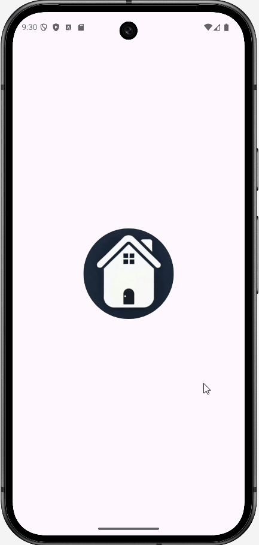
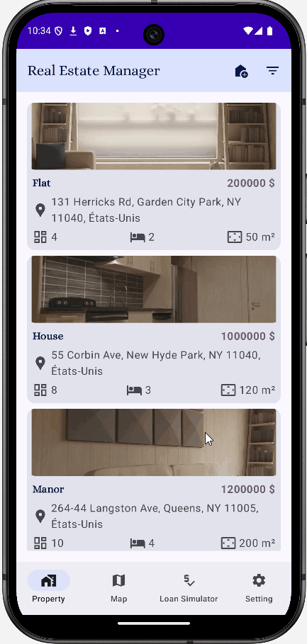
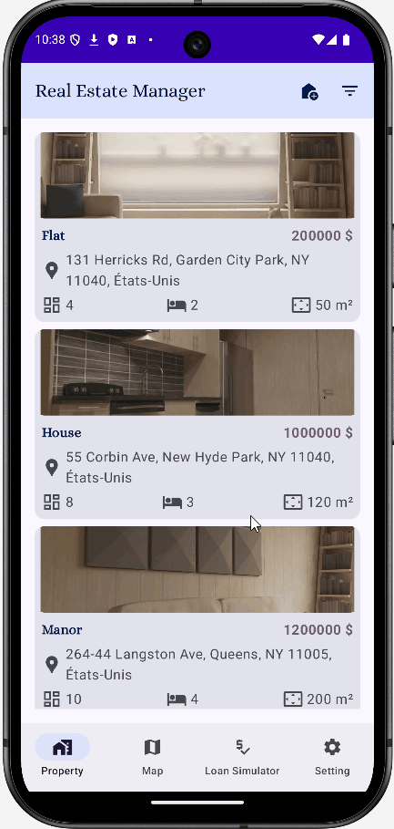

# RealEstateManager 

### Presentation
The "Real Estate Manager" project is an Android application developed for a luxury real estate agency in New York. Its goal is to simplify the management of real estate properties with a user-friendly interface while adhering to Google's Material Design standards.
___

### Tech stack

- Written in `Kotlin`
- Written with `Jetpack Compose`
- use `Room` for local data acces (SQLite)
- use `Mock` and `Robolectric` for Unit tests

Design patterns used in this application :
- Dependency injection (with `Hilt`)
- Repository
- Model-View-ViewModel Architecture
- Clean Architecture
- Data Mapper Pattern
  
___

> [!IMPORTANT]
> You need to create a **secrets.properties** file in the root of the project with the following line:
MAPS_API_KEY=**your_api_key**
This is required for the static map to work.
___

## Demo 

### List view

### List and Detail view 

### Filter properties

### Map view

### Setting

### Loan Simulator

### Create new real estate property

## Prerequisites
To install the application, you need an Android phone with a minimum API 21.
